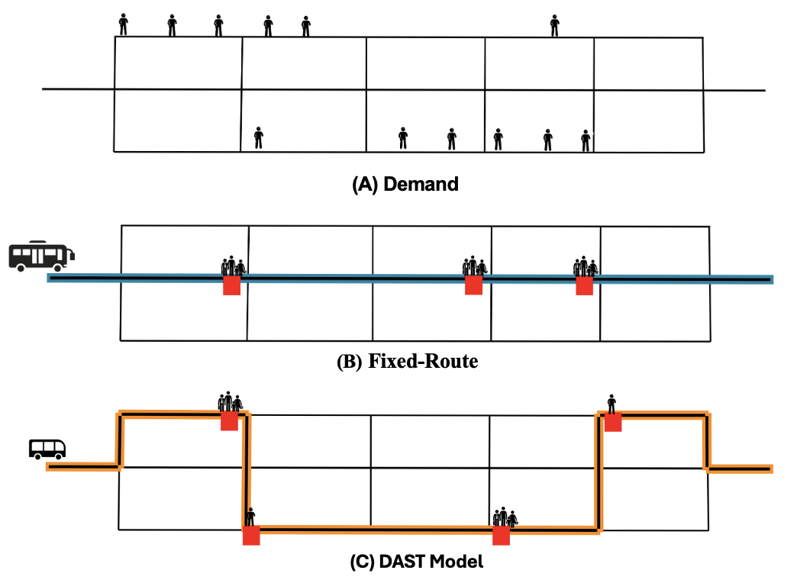

# Autonomous Shuttles vs Traditional Buses in SUMO

This repository contains the simulation framework, algorithms, and scenarios developed for the Master's thesis by Fuad Nassar at the Technical University of Munich (TUM). 

The project evaluates and compares the performance of **Traditional Fixed-Route Buses** against a **Dynamic Autonomous Stop-Based Transit (DAST)** system. Built on top of the SUMO (Simulation of Urban MObility) traffic simulator, this framework is designed to handle high-density demand (5,000–15,000 daily trips) using a limited fleet of midi-sized autonomous buses.


---

## 📑 Table of Contents
1. [Project Overview](#project-overview)
2. [Repository Structure](#repository-structure)
3. [Prerequisites & Installation](#prerequisites--installation)
4. [Usage](#usage)
5. [Key Components](#key-components)
6. [License](#license)

---

## 🚀 Project Overview

Modern urban mobility requires efficient, scalable, and dynamic solutions. This project models a transition from traditional static public transit to a dynamic, demand-responsive system using autonomous shuttles. 

**Key Features Evaluated:**
* **Traditional System:** Fixed routes, static schedules, and standard-capacity buses.
* **DAST System:** Stop-to-stop on-demand routing, dynamic dispatching, and midi-sized autonomous shuttles.
* **Performance Metrics:** Passenger wait times, travel times, fleet utilization, and system scalability under heavy synthetic demand.

---

## 📂 Repository Structure

The project is modularly structured to separate data, scenario configurations, and algorithmic logic:

```text
Autonomous-shuttles-vs-traditional-buses-in-SUMO/
│
├── data/
│   └── synthetic_demand_friham_nord/    # Synthetic demand generation scripts and XML/CSV outputs
│
├── scenarios/
│   ├── fixed_route_bus/                 # SUMO network, route, and config files for traditional buses
│   └── dast_scenario/                   # SUMO network, route, and config files for DAST
│
├── algorithms/
│   └── drt_manager/                     # High-performance event-driven dispatching algorithm
│
├── smart_transit_assigner/              
│   ├── assigner_fixed_route/            # Assignment logic and runners for the fixed route system
│   └── assigner_dast/                   # Assignment logic and runners for the autonomous system
│
├── README.md                            # Project overview and instructions
├── .gitignore                           # Excludes large SUMO output/temp files
└── requirements.txt                     # Required Python packages (traci, sumolib, pandas, etc.)
```

---

## ⚙️ Prerequisites & Installation

To run these simulations, you need to have **SUMO** and **Python 3.x** installed.

### 1. Install SUMO
Ensure SUMO is installed on your system and the `SUMO_HOME` environment variable is configured correctly.
* [SUMO Installation Guide](https://sumo.dlr.de/docs/Installing.html)

### 2. Install Python Dependencies
Clone the repository and install the required Python packages:

```bash
git clone [https://github.com/fuadnassar/Autonomous-shuttles-vs-traditional-buses-in-SUMO.git](https://github.com/fuadnassar/Autonomous-shuttles-vs-traditional-buses-in-SUMO.git)
cd Autonomous-shuttles-vs-traditional-buses-in-SUMO
pip install -r requirements.txt
```

---

## 🏃‍♂️ Usage

You can run the different scenarios by navigating to their respective directories and launching the simulations.

### Running the DAST System (Dynamic Autonomous Shuttles)
To simulate the dynamic autonomous shuttles using the DRT Manager, navigate to the scenario folder and run the Python script:
```bash
cd scenarios/dynamic_autonomous_shuttles/
python drt_manager.py -d 60 -p 120 -gui
```

### Running the Traditional Fixed-Route Baseline (FRB)
To simulate the traditional fixed-route bus network directly in the SUMO interface:
```bash
cd scenarios/fixed_route_buses/
sumo-gui sumo.sumocfg
```

---

## 🧠 Key Components

### DRT Manager
Located in `algorithms/drt_manager/`, this algorithm acts as the core engine for the DAST system, utilizing asynchronous event listeners (similar to WebSocket protocols), cached system states, and marginal cost optimization to handle massive demand with minimal computational overhead. 

See the [DRT Manager README](algorithms/drt_manager/) for deeper technical details and specific configuration arguments.

---
 
## ⚖️ License

This project is licensed under a custom **Non-Commercial Academic License**.  

Researchers and students are free to use, modify, and test this code for academic purposes. **Commercial use, including using this software to build a company, product, or service, is strictly prohibited** without prior written permission from the author. 

If this software is used for academic research that results in a publication, you must cite the original author (**Fuad Nassar**) and the associated Master's thesis at the **Technical University of Munich (TUM)**.

See the `LICENSE` file in the root directory for full legal details. For commercial licensing inquiries, please contact the author directly.
